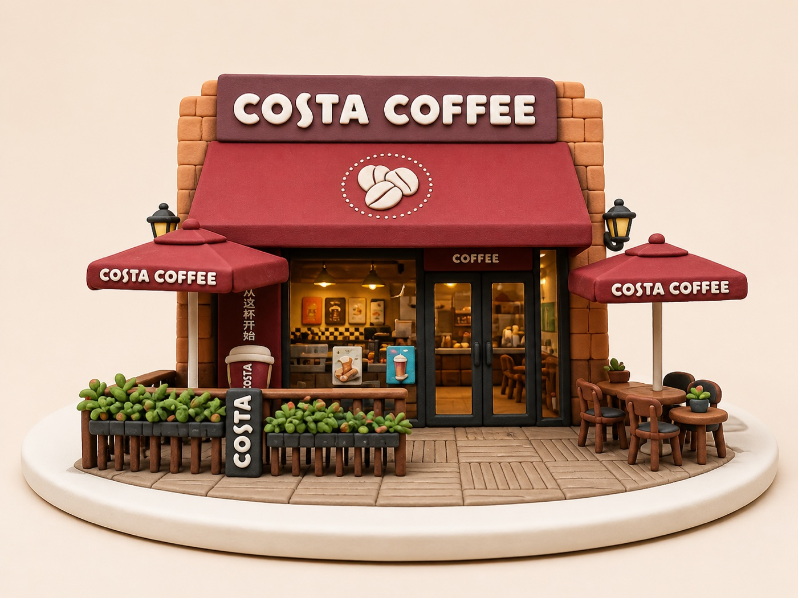
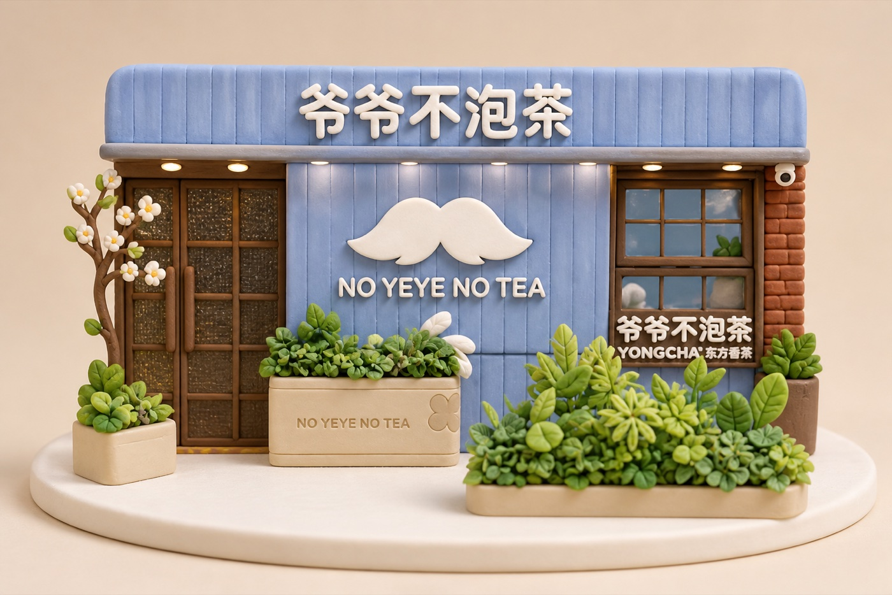
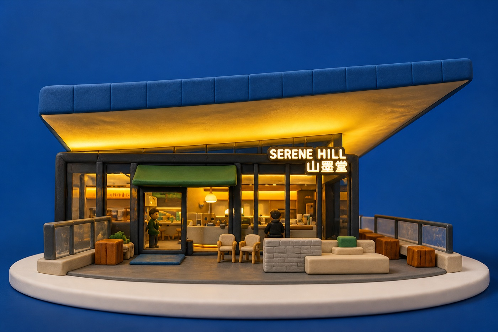
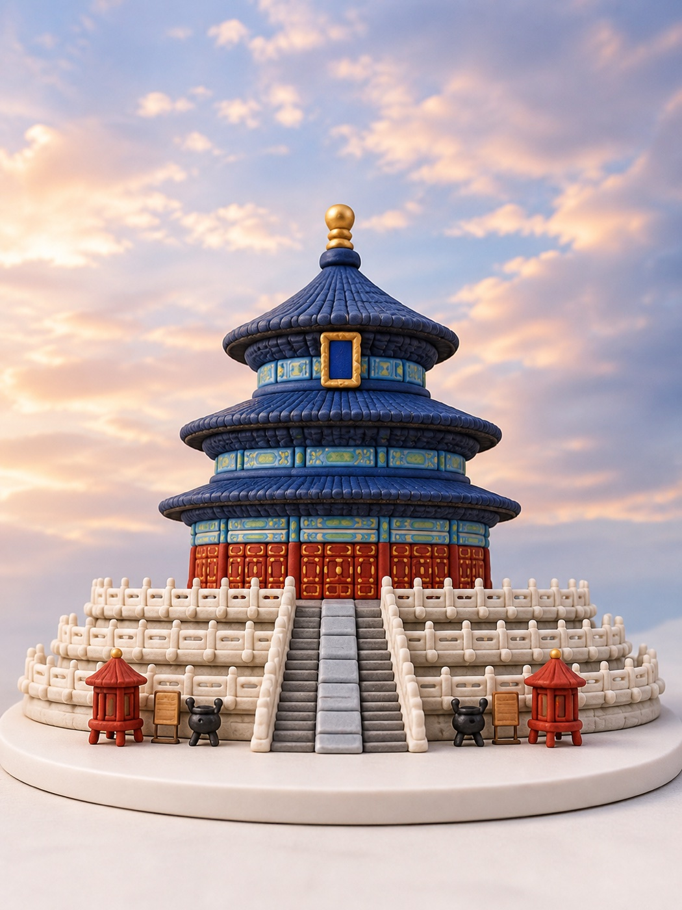

# Photo to Clay Style

[中文版](README.md)

Transform an uploaded photo into a soft, rounded clay-style 3D model with a handcrafted feel.

This is a Codex Skill for turning storefronts, buildings, streets, objects, pets, or people into charming clay miniatures while preserving the original subject, composition, and recognizable features whenever possible.

## Examples

The examples below were generated with this Skill's photo-transformation workflow. They demonstrate clay-model treatments for architectural photos and are not guaranteed reconstructions of unseen structures.

### Costa Coffee



A coffee storefront transformed into a cute clay collectible on a simple white circular base.

### NO YEYE NO TEA



A clay miniature preserving the blue facade, mustache logo, and layered plants.

### Serene Hill



A clay architectural model preserving the cantilevered roof, dusk lighting, and glass volume.

### Temple of Heaven



A cute clay commemorative model preserving the layered roofs, colorful ornament, terraces, and central axis.

## What It Does

- Converts photos into handcrafted clay or polymer-clay miniatures
- Preserves the main silhouette, key objects, relative layout, and readable signage
- Uses a stable near-front parallel perspective while retaining natural depth
- Creates soft matte materials, rounded edges, handmade details, and product-photography presentation
- Optionally adds a separate display base for collectible presentation

## Optional Display Base

The base is omitted by default. For collectible or product-display presentations, the Skill can add a thin circular base slightly wider than the model.

The base may use clean silver titanium or stainless steel with a precise, uniform, immaculate premium-product finish. Titles and collection numbers should be engraved directly into the front edge, without a bulky pedestal, attached plaque, cardboard box, or transparent package.

## Usage

Invoke it explicitly in Codex:

```text
Use $photo-to-clay-style to transform the uploaded photo into a clay miniature model.
```

For a Chinese request, you can also write:

```text
把这张照片转换成可爱的 clay 微缩模型，保留原来的构图，并使用平行透视。
```

For collectible display presentation:

```text
Transform this photo into a clay collectible model and add a thin circular silver metal base slightly wider than the model.
```

## Visual Direction

- Rounded, soft forms with subtle handmade irregularity
- Matte or lightly satin clay materials
- Warm studio lighting and soft contact shadows
- Clear layered construction with restrained detail
- Parallel perspective: a near-front view that preserves natural depth

Avoid fully orthographic projection, obvious angled views, excessive wide-angle distortion, metallic CGI gloss, flat illustration, and unrelated background clutter.

## Project Structure

```text
photo-to-clay-style/
├── SKILL.md
├── LICENSE
├── README.md
├── README.en.md
├── examples/
│   ├── costa-coffee.jpg
│   ├── no-yeye-no-tea.jpg
│   ├── serene-hill.jpg
│   └── temple-of-heaven.jpg
└── agents/
    └── openai.yaml
```

## Limitations

This Skill depends on image-generation or image-editing capabilities available in the current environment. A single photo can produce a plausible stylized interpretation, but unseen sides, backs, or interior structures may not be accurate reconstructions.

Small text in the source image may not be reproduced character-for-character. The Skill tries to preserve its placement, hierarchy, and visual shape rather than confidently inventing exact wording.

## License

MIT License. See [LICENSE](LICENSE) for details.
