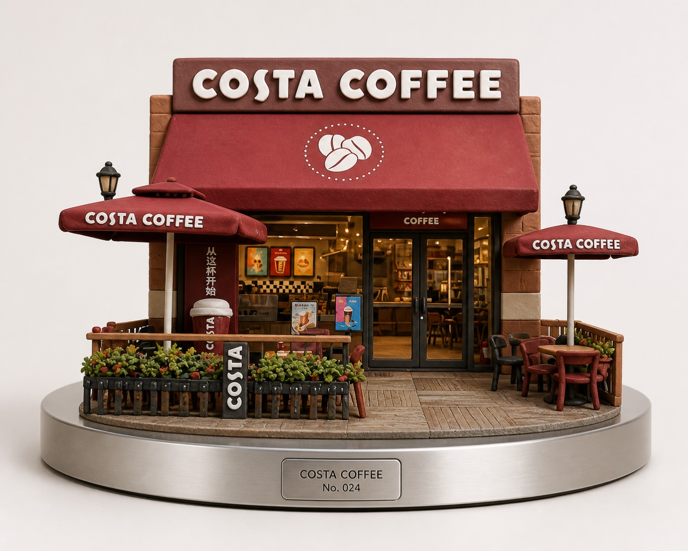
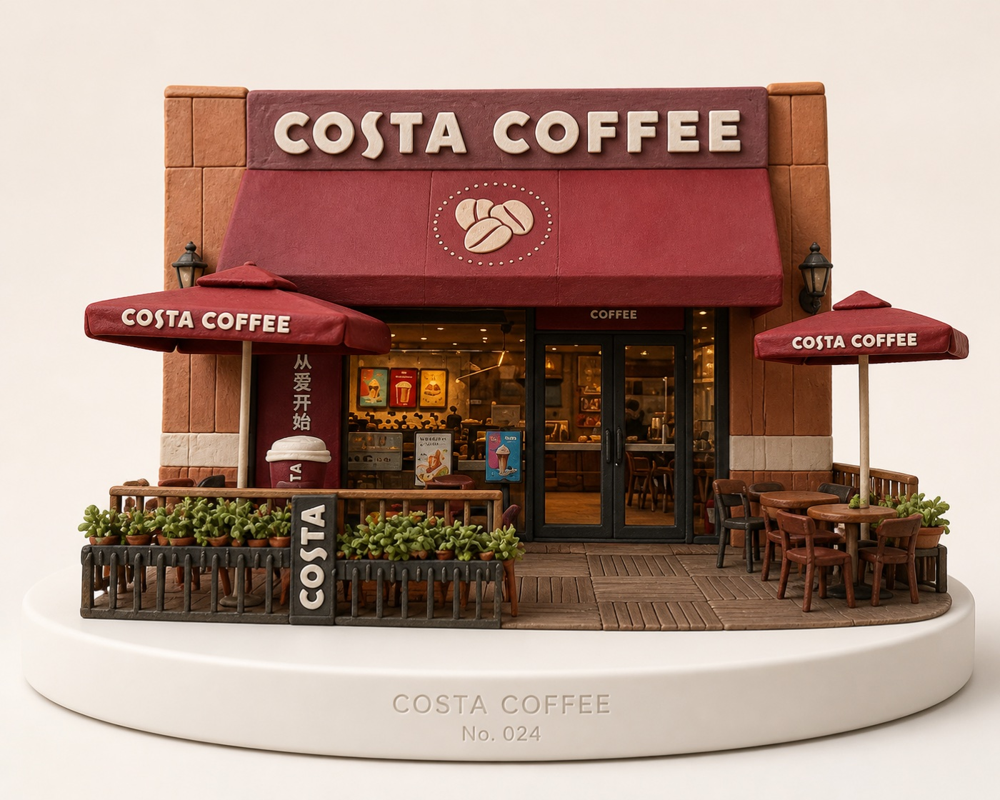
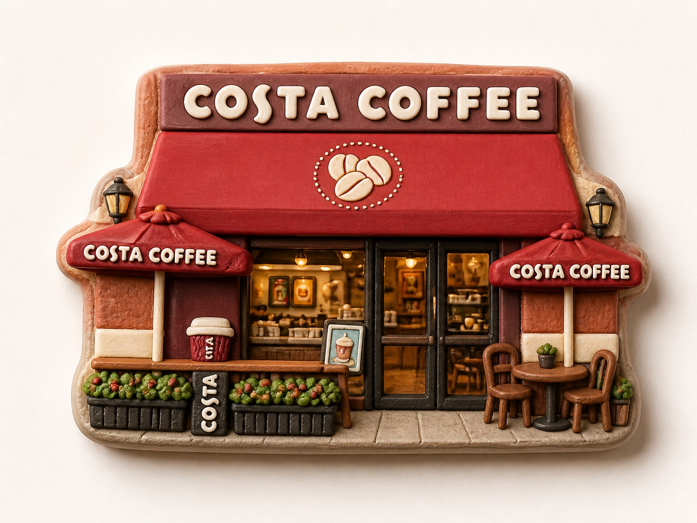
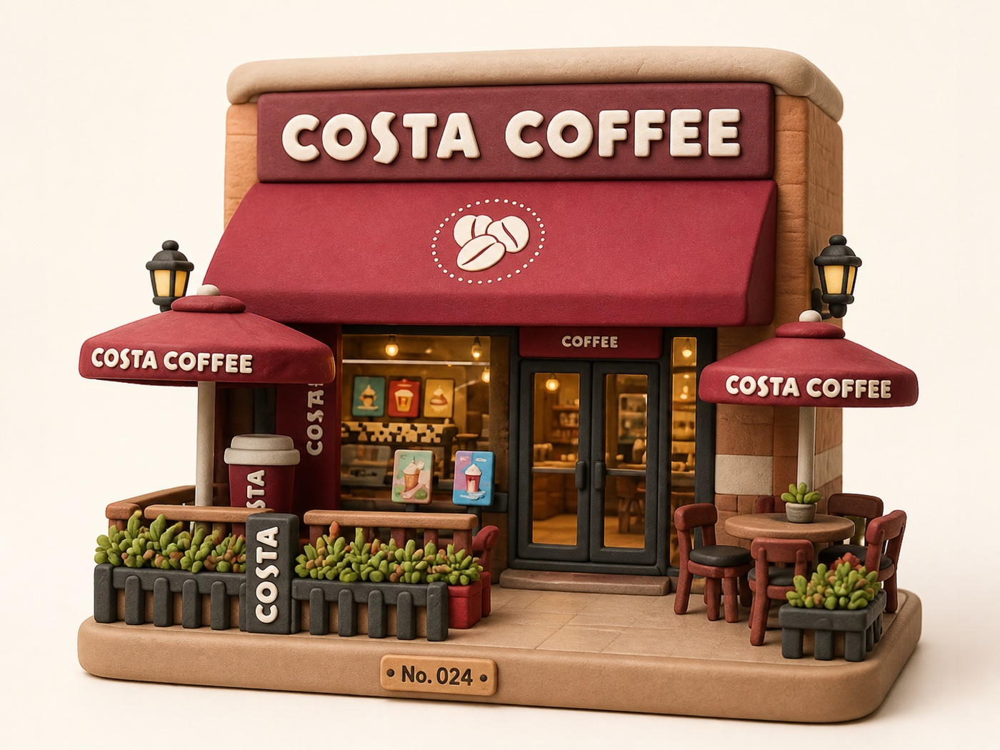

# Clay Photo Style

将用户上传的照片转换成柔和、圆润、具有手工质感的 clay 立体模型。

Transform an uploaded photo into a soft, rounded clay-style 3D model with a handcrafted feel.

这是一个 Codex Skill，适合把店铺、建筑、街景、物品、宠物或人物照片重新表现为可爱的 clay 微缩模型，同时尽量保留原照片的主体、构图和识别特征。

This is a Codex Skill for turning storefronts, buildings, streets, objects, pets, or people into charming clay miniatures while preserving the original subject, composition, and recognizable features whenever possible.

## 示例 | Examples

以下示例均由本 Skill 的照片转换流程生成。它们展示了不同的展示方式，不代表照片中不可见结构的真实还原。

The examples below were generated with this Skill's photo-transformation workflow. They demonstrate different presentation treatments and are not guaranteed reconstructions of unseen structures.

### 收藏模型与金属底座 | Collectible Model with Metal Base



独立、薄型、圆形的银色金属底座，配合低调的直接蚀刻文字。

A separate, thin, circular silver display base with subtle directly engraved identification.

### 收藏模型与纯白底座 | Collectible Model with White Base



纯白白模风格的展示底座，突出上方的店铺模型。

A clean white prototype-style display base that keeps attention on the storefront model.

### 冰箱贴实验 | Fridge Magnet Experiment



将照片压缩成适合纪念和赠送的立体冰箱贴。

A compact dimensional fridge magnet treatment designed as a small souvenir or gift.

### 摆件盲盒实验 | Blind-Box Figurine Experiment



将照片转成圆润、可爱的收藏摆件；这是实验性方向，当前 Skill 默认仍以 clay 模型为主。

A rounded, cute collectible figurine treatment. This is an experimental direction; the current Skill remains focused on clay models by default.

## 能做什么 | What It Does

- 将照片转换为 handcrafted clay / polymer-clay miniature
- 保留主体轮廓、关键物体、相对布局和可读招牌
- 使用接近正面观看的平行透视，保留自然纵深
- 生成柔和的哑光材质、圆润边缘、手工捏塑细节和产品摄影效果
- 可选添加独立的收藏品展示底座

- Converts photos into handcrafted clay or polymer-clay miniatures
- Preserves the main silhouette, key objects, relative layout, and readable signage
- Uses a stable near-front parallel perspective while retaining natural depth
- Creates soft matte materials, rounded edges, handmade details, and product-photography presentation
- Optionally adds a separate display base for collectible presentation

## 可选展示底座 | Optional Display Base

默认不添加底座。用户选择收藏模型或产品展示效果时，可以添加略大于模型整体的薄型圆形底座。

The base is omitted by default. For collectible or product-display presentations, the Skill can add a thin circular base slightly wider than the model.

底座可使用干净的银色钛金属或不锈钢材质，并采用精密、均匀、无污渍的高级产品质感。标题和收藏编号应直接蚀刻在底座前沿，不使用厚重台座、外挂铭牌、纸盒或透明包装。

The base may use clean silver titanium or stainless steel with a precise, uniform, immaculate premium-product finish. Titles and collection numbers should be engraved directly into the front edge, without a bulky pedestal, attached plaque, cardboard box, or transparent package.

## 使用方式 | Usage

在 Codex 中显式调用：

Invoke it explicitly in Codex:

```text
Use $clay-photo-style to transform the uploaded photo into a clay miniature model.
```

也可以直接用中文描述需求：

You can also describe the request directly:

```text
把这张照片转换成可爱的 clay 微缩模型，保留原来的构图，并使用平行透视。
Transform this photo into a cute clay miniature, preserve the original composition, and use parallel perspective.
```

如果需要收藏展示效果：

For collectible display presentation:

```text
把这张照片转换成 clay 收藏模型，并添加一个略大于模型的薄型圆形银色金属底座。
Transform this photo into a clay collectible model and add a thin circular silver metal base slightly wider than the model.
```

## 视觉方向 | Visual Direction

- 圆润、柔和、略带手工不规则感
- 哑光或轻微缎面 clay 材质
- 温暖的工作室灯光和柔和接触阴影
- 清晰的分层结构和适度细节
- 平行透视：接近正面观看，但保留自然空间纵深

- Rounded, soft forms with subtle handmade irregularity
- Matte or lightly satin clay materials
- Warm studio lighting and soft contact shadows
- Clear layered construction with restrained detail
- Parallel perspective: a near-front view that preserves natural depth

避免使用完全正交投影、明显斜拍、过度广角畸变、金属 CGI 光泽、扁平插画和无关背景杂物。

Avoid fully orthographic projection, obvious angled views, excessive wide-angle distortion, metallic CGI gloss, flat illustration, and unrelated background clutter.

## 项目结构 | Project Structure

```text
clay-photo-style/
├── SKILL.md
├── LICENSE
├── README.md
├── examples/
│   ├── costa-metal-base.jpg
│   ├── costa-white-base.jpg
│   ├── costa-fridge-magnet.jpg
│   └── costa-blind-box.jpg
└── agents/
    └── openai.yaml
```

## 限制 | Limitations

这个 Skill 依赖当前环境可用的图像生成或图像编辑能力。单张照片可以生成风格化的合理推测，但照片中不可见的侧面、背面或室内结构不一定是真实还原。

This Skill depends on image-generation or image-editing capabilities available in the current environment. A single photo can produce a plausible stylized interpretation, but unseen sides, backs, or interior structures may not be accurate reconstructions.

照片中的小字号文字可能无法逐字准确保留；Skill 会尽量保留其位置、层级和视觉形状，避免凭空生成确定内容。

Small text in the source image may not be reproduced character-for-character. The Skill tries to preserve its placement, hierarchy, and visual shape rather than confidently inventing exact wording.

## License

MIT License，详见 [LICENSE](LICENSE)。

MIT License. See [LICENSE](LICENSE) for details.
